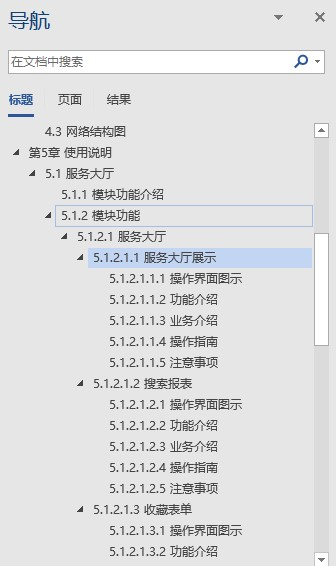

# Gitbook Markdown 撰写规范

# 标题规范

## 所有标题的序号不要手动填写

在生成文档或者使用 Gitbook 搭建服务展示的时候可以在 _book.json_ 里面添加 _theme-default_ 来自动显示序号。

```
"theme-default": {
            "showLevel": true
        },
```

## 标题样式

标题使用 _华南师范大学教师填表系统-用户操作手册_ 的目录设置样式：

* 顶层章节使用 H1
* 顶层章节的子章节使用 H2
* 顶层章节的子章节的子章节用 H3
* 以此类推

举例：

* 其中，第一章为 H1 
* 第二章为 H1
* 第 1.1 章为 H2
* 第 1.1.1 章为 H3
* 以此类推
* 正文一概使用 Paragrapg 显示

严格按照样式去分段落可以方便后期添加序号。



# 正文规范

## 正文不需要缩进

所有 Markdown 格式的文档都不需要缩进。

## 善用空行和空格

* 每个段落后面添加一行空行。
* 每个英文单词前后用空格分开，如 
  ```
  你好 Hello World 世界！
  ```

## 正文中的图片

图片一致存放在 _assets + 系统简写_ 的目录内。以章节模块的拼音简写 + 图片序号来命名。

以下都是以填表系统的撰写为例。

所有填表系统的路径均为 _assets/tbxt_ 。

填表系统 - 服务大厅 的第一张图片，则为 _assets/tbxt/ffdt-1.png_ 。

填表系统 - 标准管理 - 官方库管理 的第一张图片，则为 _assets/tbxt/bzgl-gfkgl-1.png_ 。

填表系统 - 标准管理 - 官方库管理 的第二张图片，则为 _assets/tbxt/bzgl-gfkgl-2.png_ 。

填表系统 - 标准管理 - 代码集管理 的第一张图片，则为 _assets/tbxt/bzgl-dmjgl-1.png_ 。

## 章节

每个模块为一个 Article ，每个子模块也为一个 Article，并添加在父 Article 下面。


添加方法如下 ：


